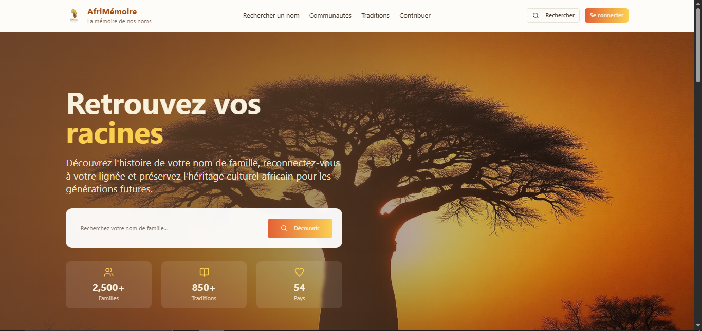
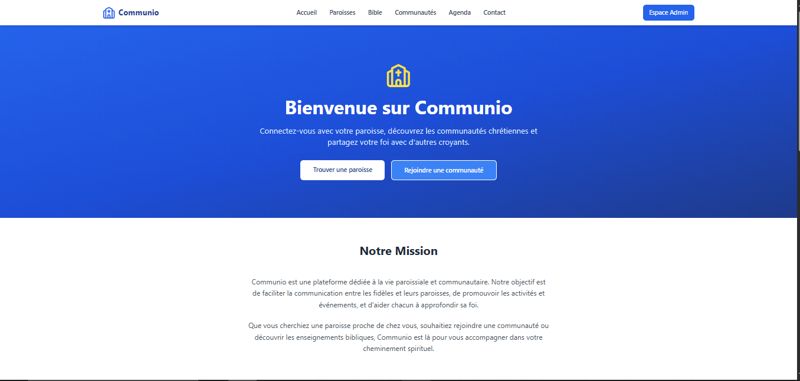
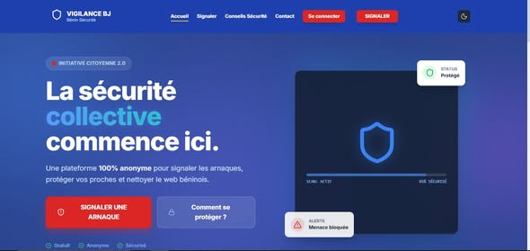

# Document sur le Portfolio d'Eucher ABATTI

## Introduction

Ce document présente le portfolio numérique d'Eucher ABATTI, un développeur Full-Stack Web & Mobile basé au Bénin. Le portfolio met en avant ses compétences, ses expériences professionnelles et une sélection de projets qu'il a réalisés. Construit avec des technologies modernes comme React, TypeScript et Tailwind CSS, ce site web offre une expérience utilisateur fluide et responsive.

Le portfolio comprend plus de 18 projets dans divers domaines tels que le développement web, le design, l'automatisation et les applications mobiles. Il est déployé sur Netlify et accessible via [eucher.dev](https://eucherdev-portfolio.netlify.app).

## Présentation de 3 Projets

Voici une sélection de trois projets phares issus du portfolio, chacun illustrant différentes compétences et technologies utilisées par Eucher ABATTI.

### 1. Afrimemorie
**Catégorie :** Web Design  
**Technologies :** React, Node.js, MongoDB  
**Statut :** En cours  
**Description :** Afrimemorie est une plateforme web dédiée à la préservation et au partage de mémoires africaines. Ce projet utilise React pour le front-end, Node.js pour le back-end et MongoDB pour la base de données. Il permet aux utilisateurs de créer, partager et explorer des histoires personnelles et culturelles africaines.  
**Lien :** [Afrimemorie](https://afri-memory.netlify.app/)  
**Image :** 

### 2. Communio
**Catégorie :** Full-Stack  
**Technologies :** React, Node.js  
**Statut :** En cours  
**Description :** Application web et mobile pour la communauté chrétienne : géolocalisation des paroisses, Bible interactive, gestion de communautés et partage d'intentions de prière. Développée avec React pour le front-end et Node.js pour le back-end.  
**Lien :** [Communio](https://communio-christian.netlify.app/)  
**Image :** 

### 3. Vigilance BJ
**Catégorie :** Full-Stack  
**Technologies :** TypeScript, Supabase  
**Statut :** Terminé  
**Description :** Vigilance BJ est une application web pour la surveillance et la gestion de la sécurité au Bénin. Développée avec TypeScript pour une meilleure robustesse et Supabase pour l'authentification et la base de données, cette plateforme permet aux utilisateurs de signaler des incidents et de suivre les alertes en temps réel.  
**Lien :** [Vigilance BJ](https://vigilance-bj.vercel.app/)  
**Image :** 

## Conclusion

Le portfolio d'Eucher ABATTI témoigne de son expertise en développement web et mobile, ainsi que de sa capacité à mener des projets multidisciplinaires. Pour plus de détails sur ces projets ou pour discuter de collaborations, n'hésitez pas à le contacter via son email : abattieucher@gmail.com ou son téléphone : +229 01 57 00 24 27.

*Document créé le 13 janvier 2026*