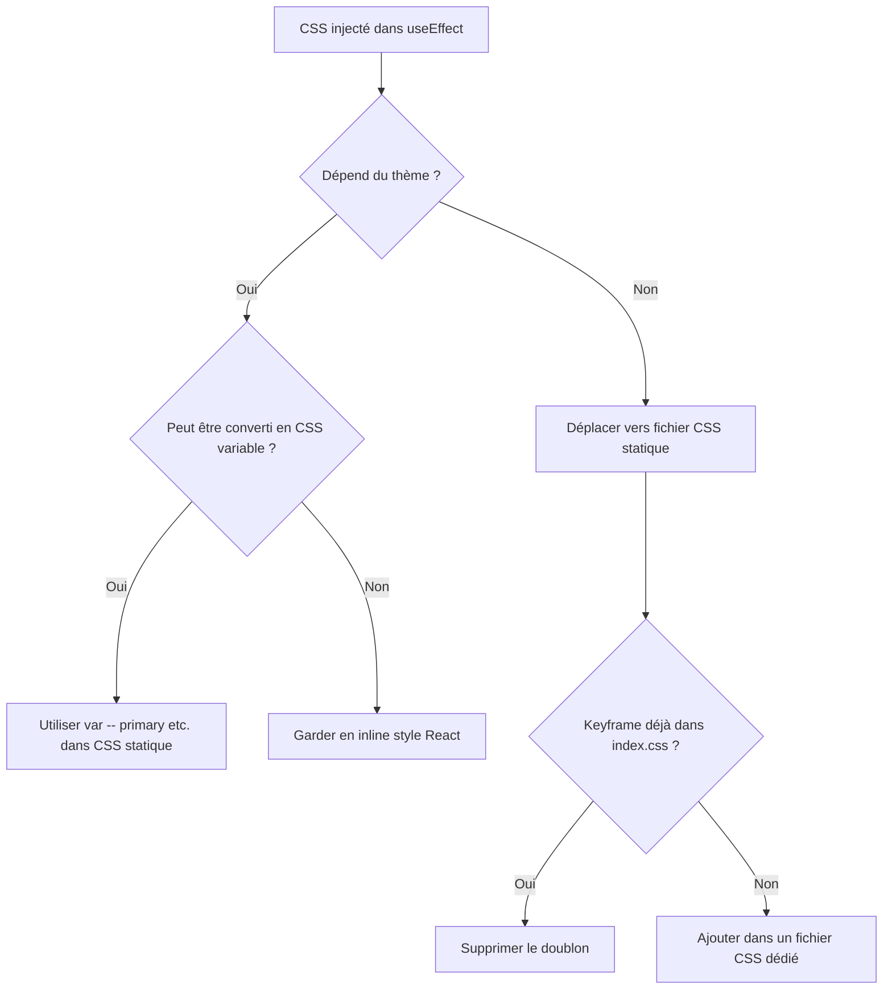
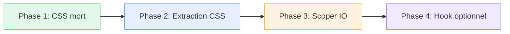

# Plan de Refactoring — IntersectionObserver & CSS Injecté

> **Fichiers concernés :**
> - [`EvolutionSection.tsx`](src/components/EvolutionSection.tsx) (~493 lignes)
> - [`ProjectsSection.tsx`](src/components/ProjectsSection.tsx) (~1167 lignes)
> - [`ServicesSection.tsx`](src/components/ServicesSection.tsx) (~900 lignes)

---

## 1. Diagnostic détaillé

### 1.1 Anti-pattern 1 : `document.querySelectorAll` dans `useEffect`

| Fichier | Sélecteur | Dépendances du `useEffect` | Risque de collision |
|---|---|---|---|
| [`EvolutionSection.tsx`](src/components/EvolutionSection.tsx:243) | `[data-card-id]` | `[activeTab]` | **Élevé** — sélecteur générique, peut capturer des éléments d'autres composants |
| [`ProjectsSection.tsx`](src/components/ProjectsSection.tsx:506) | `[data-project-id]` | `[paginatedProjects]` | **Moyen** — attribut plus spécifique mais toujours global |
| [`ServicesSection.tsx`](src/components/ServicesSection.tsx:255) | `[data-animate-id]` | `[paginatedServices, activeCategory]` | **Élevé** — sélecteur très générique, réutilisable par n'importe quel composant |

**Problèmes communs :**
1. Les éléments DOM peuvent ne pas être rendus au moment de l'exécution du `useEffect` (race condition avec le rendu React)
2. Le `querySelectorAll` opère sur tout le document, pas seulement sur le sous-arbre du composant
3. Le cleanup ne fonctionne que sur les éléments capturés au moment de la création de l'observer, pas sur ceux ajoutés dynamiquement après

### 1.2 Anti-pattern 2 : Injection CSS via `document.createElement('style')`

| Fichier | Style ID | Lignes CSS | Nettoyage au démontage | Dépend du thème |
|---|---|---|---|---|
| [`EvolutionSection.tsx`](src/components/EvolutionSection.tsx:160) | `evolution-section-animations` | ~52 lignes | ❌ Non | ❌ Non |
| [`ProjectsSection.tsx`](src/components/ProjectsSection.tsx:570) | `projects-section-animations` | ~87 lignes | ❌ Non | ❌ Non |
| [`ServicesSection.tsx`](src/components/ServicesSection.tsx:264) | `services-section-animations` | ~200 lignes | ❌ Non | ⚠️ Oui — `colors.primary` dans `blink` et `typewriter` |

**Problèmes communs :**
1. Les styles ne sont jamais retirés du DOM au démontage du composant
2. Le guard `if (!document.getElementById(styleId))` empêche la mise à jour si le thème change (problème spécifique à `ServicesSection`)
3. Contourne complètement le système de styles React/Tailwind

---

## 2. Audit CSS : Classes utilisées vs inutilisées

### 2.1 [`EvolutionSection.tsx`](src/components/EvolutionSection.tsx) — CSS injecté (lignes 165-217)

| Keyframe/Classe | Utilisée dans le JSX ? | Déjà dans [`index.css`](src/index.css) ? |
|---|---|---|
| `@keyframes fade-in-up` | ❌ Non — les animations sont faites via inline styles `opacity`/`transform` | ❌ Non (mais `slide-up` est similaire) |
| `@keyframes fade-in` | ❌ Non | ✅ Oui — [`index.css:372`](src/index.css:372) |
| `@keyframes curtain-reveal` | ❌ Non | ✅ Oui — [`index.css:416`](src/index.css:416) (version différente avec `clip-path`) |
| `@keyframes slide-in-left` | ❌ Non | ❌ Non |
| `@keyframes slide-in-right` | ❌ Non | ❌ Non |

> **Conclusion : 100% du CSS injecté dans EvolutionSection est inutilisé.** Toutes les animations sont gérées via des inline styles (`opacity`, `transform`, `transitionDelay`). Le bloc entier peut être supprimé sans régression.

### 2.2 [`ProjectsSection.tsx`](src/components/ProjectsSection.tsx) — CSS injecté (lignes 575-662)

| Keyframe/Classe | Utilisée dans le JSX ? | Déjà dans [`index.css`](src/index.css) ? |
|---|---|---|
| `@keyframes project-card-reveal` | ❌ Non — les animations de cartes sont faites via inline styles | ❌ Non |
| `@keyframes float-animation` | ✅ Oui — via `.project-float` sur le bouton CTA (ligne 996) | ❌ Non (mais `float` dans index.css est similaire) |
| `@keyframes shimmer` | ✅ Oui — via `.project-shimmer` sur les badges (lignes 673, 983) | ❌ Non |
| `@keyframes slide-in-left` | ✅ Oui — via inline `animation` sur les boutons catégorie (ligne 744) | ❌ Non |
| `@keyframes slide-in-right` | ✅ Oui — via inline `animation` sur les boutons catégorie (ligne 744) | ❌ Non |
| `.project-shimmer` | ✅ Oui | — |
| `.project-float` | ✅ Oui | — |
| `.project-card-hover` | ✅ Oui — sur les cartes projet (ligne 782) et le bouton CTA (ligne 996) | — |
| `.project-card-hover:hover` | ✅ Oui | — |
| `.overflow-x-auto::-webkit-scrollbar` | ✅ Oui — masque la scrollbar des catégories | — |
| `.overflow-x-auto` (scrollbar-width) | ✅ Oui | — |

> **Conclusion : `@keyframes project-card-reveal` est inutilisé.** Les 5 autres keyframes et 4 classes utilitaires sont activement utilisées.

### 2.3 [`ServicesSection.tsx`](src/components/ServicesSection.tsx) — CSS injecté (lignes 269-468)

| Keyframe/Classe | Utilisée dans le JSX ? |
|---|---|
| `@keyframes fade-in-up` | ❌ Non — `.fade-in-up` utilise des transitions, pas cette keyframe |
| `@keyframes typewriter` | ✅ Oui — via `.typewriter` (ligne 497) |
| `@keyframes blink` | ✅ Oui — via `.typewriter` (ligne 497) |
| `@keyframes draw-line` | ❌ Non — `.code-line` n'est jamais utilisée dans le JSX |
| `@keyframes app-load` | ❌ Non — `.app-loading` est utilisée comme className SVG mais l'animation est gérée par `<animate>` SVG natif |
| `.typewriter` | ✅ Oui |
| `.fade-in-up` / `.fade-in-up.visible` | ✅ Oui — lignes 712, 874 |
| `.service-card` / `.service-card.visible` | ✅ Oui — ligne 755 |
| `.expertise-card` / `.expertise-card.visible` | ✅ Oui — ligne 514 |
| `.expertise-svg` / `.expertise-svg:hover` | ✅ Oui — ligne 554 |
| `.code-line` | ❌ Non — jamais référencée dans le JSX |
| `.data-rotate` | ❌ Non |
| `.design-pulse` | ❌ Non |
| `.cloud-float` | ❌ Non |
| `.web-browser` | ✅ Oui — SVG ligne 564 |
| `.code-typing` | ✅ Oui — SVG ligne 571 |
| `.phone-frame` | ✅ Oui — SVG ligne 587 |
| `.app-loading` | ✅ Oui — SVG ligne 591 (mais la règle CSS `stroke-dasharray` est redondante avec `<animate>`) |
| `.mobile-signal` | ✅ Oui — SVG ligne 594 |
| `.design-canvas` | ✅ Oui — SVG ligne 607 |
| `.ux-circle` | ✅ Oui — SVG ligne 610 |
| `.design-path` | ✅ Oui — SVG ligne 613 |
| `.design-element` | ✅ Oui — SVG ligne 616 |
| `.database-main` | ✅ Oui — SVG ligne 629 |
| `.data-ring` | ✅ Oui — SVG ligne 632 |
| `.data-node` | ✅ Oui — SVG lignes 635, 638 |
| `.data-connections` | ✅ Oui — SVG ligne 642 |
| `.cloud-main` | ✅ Oui — SVG ligne 649 |
| `.cloud-secondary` | ✅ Oui — SVG ligne 652 |
| `.cloud-tertiary` | ✅ Oui — SVG ligne 655 |
| `.server-rack` | ✅ Oui — SVG ligne 659 |
| `.ai-brain` | ✅ Oui — SVG ligne 681 |
| `.ai-core` | ✅ Oui — SVG ligne 684 |
| `.neural-path` | ✅ Oui — SVG ligne 688 |
| `.neural-node` | ✅ Oui — SVG lignes 691, 694, 697, 700 |
| `.connection-pulse` | ✅ Oui — SVG ligne 577 |

> **Conclusion :** Les keyframes `fade-in-up`, `draw-line`, `app-load` sont inutilisées. Les classes `.code-line`, `.data-rotate`, `.design-pulse`, `.cloud-float` sont inutilisées. Toutes les classes SVG `transform-origin: center` sont utilisées mais ne font que définir `transform-origin` — elles pourraient être remplacées par un sélecteur unique. Le CSS dépendant du thème (`colors.primary` dans `blink`/`typewriter`) pose un problème car le style n'est jamais mis à jour au changement de thème.

---

## 3. Évaluation des approches pour l'IntersectionObserver

### 3.1 Option A : Callback Refs

```tsx
const observerRef = useRef<IntersectionObserver | null>(null);

const cardRef = useCallback((node: HTMLElement | null) => {
  if (node) observerRef.current?.observe(node);
}, []);

// Dans le JSX : <div ref={cardRef} ...>
```

| Critère | Évaluation |
|---|---|
| Risque de régression | ⚠️ Moyen — nécessite de modifier le JSX de chaque carte |
| Scope correct | ✅ Observe uniquement les éléments du composant |
| Gestion du cycle de vie | ✅ Automatique via le ref callback |
| Complexité | ⚠️ Moyenne — nécessite un `useRef` pour l'observer + `useCallback` pour le ref |
| Nouvelles dépendances | ✅ Aucune |

### 3.2 Option B : `react-intersection-observer` (bibliothèque npm)

```tsx
import { useInView } from 'react-intersection-observer';

const { ref, inView } = useInView({ threshold: 0.2 });
// Dans le JSX : <div ref={ref} className={inView ? 'visible' : ''}>
```

| Critère | Évaluation |
|---|---|
| Risque de régression | ✅ Faible — API simple et bien testée |
| Scope correct | ✅ Observe uniquement l'élément référencé |
| Gestion du cycle de vie | ✅ Automatique |
| Complexité | ✅ Faible |
| Nouvelles dépendances | ❌ Ajoute `react-intersection-observer` (~3.5 KB gzipped) |

### 3.3 Option C : `querySelectorAll` scopé avec un container ref

```tsx
const containerRef = useRef<HTMLDivElement>(null);

useEffect(() => {
  const container = containerRef.current;
  if (!container) return;
  
  const elements = container.querySelectorAll('[data-card-id]');
  // ... observer logic
}, [activeTab]);
```

| Critère | Évaluation |
|---|---|
| Risque de régression | ✅ Très faible — changement minimal |
| Scope correct | ✅ Limité au sous-arbre du composant |
| Gestion du cycle de vie | ⚠️ Même limitation que l'actuel pour les éléments ajoutés dynamiquement |
| Complexité | ✅ Très faible — ajout d'un seul `ref` |
| Nouvelles dépendances | ✅ Aucune |

### 3.4 Recommandation

**→ Option C (querySelectorAll scopé) comme première étape, puis migration progressive vers Option A (callback refs) pour les composants les plus critiques.**

**Justification :**
1. L'Option C est le changement le plus sûr avec le moins de risque de régression visuelle — idéal pour un portfolio en production
2. Elle corrige le problème principal (scope global) avec un diff minimal
3. `EvolutionSection` et `ServicesSection` ont déjà un `sectionRef` ou pourraient en avoir un facilement
4. `ProjectsSection` utilise déjà `categoriesRef` — on ajoute simplement un `sectionRef` englobant
5. L'Option A peut être appliquée dans un second temps pour les cas où les éléments sont ajoutés/retirés dynamiquement (pagination)

**L'Option B est exclue** car la contrainte est de ne pas ajouter de nouvelles dépendances npm.

---

## 4. Recommandation pour le CSS injecté

### 4.1 Stratégie globale



### 4.2 Destination du CSS

| Source | Destination recommandée | Raison |
|---|---|---|
| Keyframes partagées entre composants (`slide-in-left`, `slide-in-right`, `fade-in-up`) | [`src/index.css`](src/index.css) section `KEYFRAME ANIMATIONS` | Réutilisables globalement |
| Classes spécifiques à ProjectsSection (`.project-shimmer`, `.project-float`, `.project-card-hover`) | Nouveau fichier `src/styles/projects.css` | Isolation par composant |
| Classes spécifiques à ServicesSection (`.typewriter`, `.service-card`, `.expertise-card`, classes SVG) | Nouveau fichier `src/styles/services.css` | Isolation par composant |
| CSS dépendant du thème (`.typewriter` avec `border-color` et `blink` avec `colors.primary`) | Convertir en CSS variables : `border-color: var(--color-primary)` | Le système de thème devrait exposer des CSS custom properties |

### 4.3 Vérification du système de thème

Le [`ThemeContext.tsx`](src/contexts/ThemeContext.tsx) expose `colors.primary` etc. comme valeurs JavaScript. Pour que le CSS statique puisse utiliser les couleurs du thème, il faudra vérifier si des CSS custom properties (`--color-primary`) sont déjà définies. Si non, il faudra les ajouter dans le `ThemeContext` via un `useEffect` qui met à jour `document.documentElement.style.setProperty()`.

---

## 5. Plan d'exécution étape par étape

### Phase 1 : Nettoyage du CSS mort (risque minimal)

#### Étape 1.1 — EvolutionSection : Supprimer tout le bloc CSS injecté
- **Fichier :** [`EvolutionSection.tsx`](src/components/EvolutionSection.tsx:159-221)
- **Action :** Supprimer entièrement le `useEffect` des lignes 159-221 (injection CSS)
- **Justification :** 100% du CSS injecté est inutilisé — toutes les animations sont en inline styles
- **Test :** Vérifier que les animations de timeline et de compétences fonctionnent toujours au scroll

#### Étape 1.2 — ProjectsSection : Supprimer la keyframe inutilisée
- **Fichier :** [`ProjectsSection.tsx`](src/components/ProjectsSection.tsx:576-592)
- **Action :** Retirer `@keyframes project-card-reveal` du bloc CSS injecté (lignes 576-592)
- **Test :** Aucun impact visuel attendu

#### Étape 1.3 — ServicesSection : Supprimer les classes et keyframes inutilisées
- **Fichier :** [`ServicesSection.tsx`](src/components/ServicesSection.tsx:269-468)
- **Action :** Retirer du bloc CSS :
  - `@keyframes fade-in-up` (la classe `.fade-in-up` utilise des transitions, pas cette keyframe)
  - `@keyframes draw-line` et `.code-line`
  - `@keyframes app-load` (redondant avec `<animate>` SVG)
  - `.data-rotate`, `.design-pulse`, `.cloud-float`
- **Test :** Vérifier les animations SVG dans la section expertise

### Phase 2 : Extraction du CSS vers des fichiers statiques

#### Étape 2.1 — Créer `src/styles/projects.css`
- **Contenu :** Déplacer depuis [`ProjectsSection.tsx`](src/components/ProjectsSection.tsx:570-665) :
  - `@keyframes float-animation`
  - `@keyframes shimmer`
  - `.project-shimmer`
  - `.project-float`
  - `.project-card-hover` et `.project-card-hover:hover`
  - Règles scrollbar `.overflow-x-auto`
- **Action complémentaire :** Importer dans [`main.tsx`](src/main.tsx) ou [`App.tsx`](src/App.tsx)
- **Action complémentaire :** Supprimer le `useEffect` d'injection CSS dans `ProjectsSection.tsx`

#### Étape 2.2 — Déplacer `slide-in-left` et `slide-in-right` dans [`index.css`](src/index.css)
- **Raison :** Ces keyframes sont utilisées par `ProjectsSection` (boutons catégorie) et potentiellement réutilisables
- **Emplacement :** Section `KEYFRAME ANIMATIONS` de [`index.css`](src/index.css:325)

#### Étape 2.3 — Créer `src/styles/services.css`
- **Contenu :** Déplacer depuis [`ServicesSection.tsx`](src/components/ServicesSection.tsx:264-471) :
  - `@keyframes typewriter` (sans la valeur `colors.primary` — voir étape 2.4)
  - `@keyframes blink` (sans la valeur `colors.primary` — voir étape 2.4)
  - `.typewriter`
  - `.fade-in-up` / `.fade-in-up.visible`
  - `.service-card` / `.service-card.visible`
  - `.expertise-card` / `.expertise-card.visible`
  - `.expertise-svg` / `.expertise-svg:hover`
  - Toutes les classes SVG `transform-origin: center` — regrouper en un sélecteur unique :
    ```css
    .web-browser, .code-typing, .phone-frame, .app-loading,
    .mobile-signal, .design-canvas, .ux-circle, .design-path,
    .design-element, .database-main, .data-ring, .data-node,
    .data-connections, .cloud-main, .cloud-secondary, .cloud-tertiary,
    .server-rack, .ai-brain, .ai-core, .neural-path, .neural-node,
    .connection-pulse {
      transform-origin: center;
    }
    ```
  - `.app-loading` avec `stroke-dasharray`/`stroke-dashoffset`
- **Action complémentaire :** Importer dans [`main.tsx`](src/main.tsx) ou [`App.tsx`](src/App.tsx)

#### Étape 2.4 — Résoudre la dépendance au thème dans ServicesSection
- **Problème :** `.typewriter` et `@keyframes blink` utilisent `${colors.primary}` qui est une valeur JS dynamique
- **Solution recommandée :** Utiliser une CSS custom property
  ```css
  /* services.css */
  @keyframes blink {
    0%, 50% { border-color: transparent; }
    51%, 100% { border-color: var(--theme-primary); }
  }
  .typewriter {
    border-right: 3px solid var(--theme-primary);
    /* ... */
  }
  ```
- **Action complémentaire :** Vérifier si [`ThemeContext.tsx`](src/contexts/ThemeContext.tsx) définit déjà `--theme-primary` sur le `document.documentElement`. Si non, ajouter un `useEffect` dans le ThemeContext :
  ```tsx
  useEffect(() => {
    document.documentElement.style.setProperty('--theme-primary', colors.primary);
  }, [colors.primary]);
  ```

### Phase 3 : Scoper les IntersectionObserver

#### Étape 3.1 — EvolutionSection : Ajouter un container ref
- **Fichier :** [`EvolutionSection.tsx`](src/components/EvolutionSection.tsx:224-249)
- **Action :**
  1. Ajouter `const sectionRef = useRef<HTMLElement>(null);`
  2. Ajouter `ref={sectionRef}` sur le `<section>` (ligne 252)
  3. Remplacer `document.querySelectorAll('[data-card-id]')` par `sectionRef.current?.querySelectorAll('[data-card-id]')`
  4. Ajouter un guard `if (!sectionRef.current) return;`
- **Test :** Vérifier les animations au scroll sur les deux onglets (Expériences et Compétences)

#### Étape 3.2 — ProjectsSection : Ajouter un container ref
- **Fichier :** [`ProjectsSection.tsx`](src/components/ProjectsSection.tsx:487-512)
- **Action :**
  1. Ajouter `const sectionRef = useRef<HTMLElement>(null);`
  2. Ajouter `ref={sectionRef}` sur le `<section>` (ligne 668)
  3. Remplacer `document.querySelectorAll('[data-project-id]')` par `sectionRef.current?.querySelectorAll('[data-project-id]')`
  4. Ajouter un guard `if (!sectionRef.current) return;`
- **Test :** Vérifier les animations au scroll, le changement de catégorie et la pagination

#### Étape 3.3 — ServicesSection : Utiliser le sectionRef existant
- **Fichier :** [`ServicesSection.tsx`](src/components/ServicesSection.tsx:234-261)
- **Note :** `sectionRef` existe déjà (ligne 216) et est attaché au `<section>` (ligne 490)
- **Action :**
  1. Remplacer `document.querySelectorAll('[data-animate-id]')` par `sectionRef.current?.querySelectorAll('[data-animate-id]')`
  2. Ajouter un guard `if (!sectionRef.current) return;`
- **Test :** Vérifier les animations de la grille expertise, du filtre catégorie, des cartes services et du CTA bottom

### Phase 4 (optionnelle) : Migration vers callback refs pour ProjectsSection

> Cette phase est optionnelle et peut être réalisée ultérieurement. Elle est recommandée uniquement pour `ProjectsSection` car c'est le seul composant avec pagination dynamique.

#### Étape 4.1 — Créer un hook `useScrollReveal`
```tsx
// src/hooks/useScrollReveal.ts
function useScrollReveal(options?: IntersectionObserverInit) {
  const [visibleIds, setVisibleIds] = useState<Set<string>>(new Set());
  const observerRef = useRef<IntersectionObserver | null>(null);

  useEffect(() => {
    observerRef.current = new IntersectionObserver((entries) => {
      entries.forEach((entry) => {
        if (entry.isIntersecting) {
          const id = entry.target.getAttribute('data-reveal-id');
          if (id) setVisibleIds((prev) => new Set([...prev, id]));
        }
      });
    }, options);
    return () => observerRef.current?.disconnect();
  }, []);

  const revealRef = useCallback((node: HTMLElement | null) => {
    if (node) observerRef.current?.observe(node);
  }, []);

  const reset = () => setVisibleIds(new Set());

  return { visibleIds, revealRef, reset };
}
```

#### Étape 4.2 — Intégrer dans ProjectsSection
- Remplacer le `useEffect` IntersectionObserver par le hook
- Utiliser `revealRef` comme callback ref sur chaque carte projet
- Appeler `reset()` au changement de page/catégorie

---

## 6. Résumé des doublons keyframes

| Keyframe | Définie dans | Aussi dans [`index.css`](src/index.css) ? | Action |
|---|---|---|---|
| `fade-in` | EvolutionSection | ✅ Oui (ligne 372) | Supprimer de EvolutionSection |
| `curtain-reveal` | EvolutionSection | ✅ Oui (ligne 416, version différente) | Supprimer de EvolutionSection |
| `slide-in-left` | EvolutionSection + ProjectsSection | ❌ Non | Déplacer dans index.css |
| `slide-in-right` | EvolutionSection + ProjectsSection | ❌ Non | Déplacer dans index.css |
| `fade-in-up` | EvolutionSection + ServicesSection | ❌ Non (mais `slide-up` est similaire) | Déplacer dans index.css |

---

## 7. Ordre d'exécution recommandé



| Phase | Risque | Impact visuel | Fichiers modifiés |
|---|---|---|---|
| Phase 1 — CSS mort | 🟢 Très faible | Aucun | 3 fichiers .tsx |
| Phase 2 — Extraction CSS | 🟡 Faible | Aucun si bien fait | 3 .tsx + 2 nouveaux .css + index.css + main.tsx + possiblement ThemeContext.tsx |
| Phase 3 — Scoper IO | 🟡 Faible | Aucun | 3 fichiers .tsx |
| Phase 4 — Hook | 🟠 Moyen | Timing des animations peut varier | 1 nouveau hook + ProjectsSection.tsx |

---

## 8. Checklist de validation post-refactoring

Pour chaque phase, vérifier :

- [ ] Les animations scroll-triggered se déclenchent correctement au premier scroll
- [ ] Le changement d'onglet dans EvolutionSection réinitialise et relance les animations
- [ ] Le changement de catégorie dans ProjectsSection/ServicesSection fonctionne
- [ ] La pagination dans ProjectsSection/ServicesSection relance les animations
- [ ] Le changement de thème met à jour les couleurs dans les animations CSS (typewriter, blink)
- [ ] Aucune erreur dans la console du navigateur
- [ ] Les animations SVG de ServicesSection fonctionnent toujours
- [ ] Le build de production (`npm run build`) passe sans erreur
- [ ] Vérification visuelle sur mobile (responsive)
